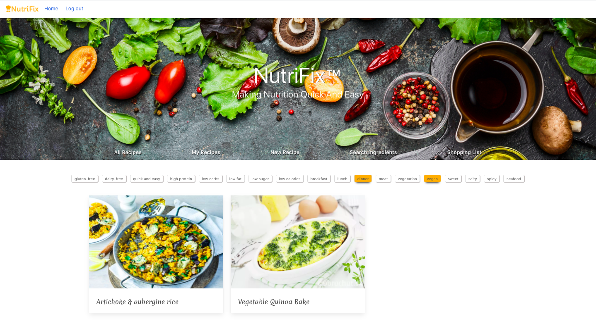

###  General Assembly, Software Engineering Immersive


# NutriFix™

## Table of Contents
1. [Overview](#Overview)
2. [Brief](#Brief)
3. [Technologies Used](#Technologies-Used)
4. [Backend](#Backend)
    - [Approach](#Approach)
    - [Models](#Models)
      - [User Model](#1.-User-Model)
      - [Recipe Model](#2.-Recipe-Model)
    - [Controllers](#Controllers)
      - [User Controller](#1.-User-Controller)
      - [Recipe Controller](#2.-Recipe-Controller)
    - [Security](#Security)
      - [Secure Routes](#Secure-Routes)
      - [Bcrypt](#Bcrypt)
      - [Token](#Token)
5. [Frontend](#Frontend)
    - [Display Recipes](#Display-Recipes)
      - [Tags](#Tags)
      - [Rendering Recipes](#Rendering-Recipes)
      - [My Recipes](#My-Recipes-(creating-your-own))
      - [Single Recipe](#Single-Recipe)
6. [Navbar](#Navbar)
7. [Ingredient Search](#Ingredient-Search)
8. [Shopping List](#Shopping-List)
9. [Screenshots](#Screenshots)
    - [Public Visitor Endpoints](#Public-Visitor-Endpoints)
    - [Secure User Endpoint](#Secure-User-Endpoints)
10. [Potential Future Features](#Potential-Future-Features)
11. [Lessons Learned](#Lessons-Learned)


## Overview
This was a 10-day group project at General Assembly London by [Hanna Truong Thi](https://github.com/hvan307), [Lucy Maitland](https://github.com/lucymait), [Thomas Bannister](https://github.com/tombannister01) and [Finlay Whittington Devereux](https://github.com/Fin101).

We all wanted to create a web app that provides healthy and nutritious recipes that users can personalise according to their needs, whether you're vegan, gluten-free, or on a high-protein diet. The website allows users to browse a great selection of recipes with the ability to mix-and-match their diet requirements. They can also add recipes of their own to their private recipe page. When in doubt, you can also search for individual ingredients, whether you're unsure how it looks like, or want to learn more about their macronutrients. Lastly, each user will have a shopping list available for their own use where they can add and remove items of their choice. 

## Brief
- Work in a team, using git to code collaboratively.
- Build a full-stack application by making your own backend and your own - front-end
- Use an Express API to serve your data from a Mongo database
- Consume your API with a separate front-end built with React
- Be a complete product which most likely means multiple relationships and CRUD functionality for at least a couple of models

## Technologies Used
- HTML
- CSS and SCSS
- Bulma
- JavaScript (ES6)
- React.js
- Node.js
- Express
- Mongo and Mongoose
- Git and GitHub
- Heroku
- Insomnia
- Google Fonts
- Font Awesome
- Imgur.com
- Logomakr
- Trello

# Backend

## Approach 

We took a MVC approach to create a functional backend. 

The components we used consisted of:

- Models (both a recipe.js and user.js), 
- View (router.js),
- Controllers (recipeController.js and userController.js).

Our api seed consisted of a User Database:

```js
 .then(() => {
        return User.create([
          {
            username: 'Admin',
            email: 'admin@admin.com',
            password: 'recipe',
            passwordConfirmation: 'recipe'
          }
        ])
      })
```
and a Recipe Database:

```js
.then(users => {
        return Recipe.create([
          {
            recipeName: 'Chocolate Tahini Bars',
            image: 'https://images.cookforyourlife.org/wp-content/uploads/2018/08/Chocolate-Tahini-Bars-696x465.jpg',
            ingredients: [
              '1 ½ cups graham cracker crumbs',
              '¾ cup confectioners’ sugar',
              '1 cup tahini',
              '¼ cup coconut oil, melted',
              '1 cup dark chocolate chips',
              '1 cup heavy cream'
            ],
            instructions: [
              'Grease a 8”x8” glass baking dish.',
              'In a large bowl, mix together graham cracker crumbs, confectioners’ sugar, tahini, and coconut oil. Pour the mixture into dish and flatten into an even layer.',
              'Place chocolate chips into a large bowl. In a small pot, bring cream to a simmer. Pour the cream over the chocolate and stir the chocolate until melted and smooth. Pour the chocolate over the tahini mixture and spread into an even layer.',
              'Cover with plastic wrap and place in the refrigerator for about 45 minutes, until the chocolate is set.',
              'Cut into 12 squares and serve.'
            ],
            calories: 364,
            macronutrients: {
              protein: '5g',
              carbohydrates: '22g',
              fat: '30g',
              sugars: '12g'
            },
            tags: [
              'sweet', 'vegan', 'dessert'
            ],
            servings: 12,
            totalTime: '60 minutes',
            isPublic: true,
            user: users[0]
          },
        ])
      })

```
## Models

It was crucial to create our schemas at stage 1 to ensure that we had a solid backend and that our databases would run smoothly, without having to amend it at a later stage.

Majority of our fields were 'required: true' to make sure the user fills out the input fields in the frontend. 

For example in our user schema the user would have to fill out:

- username
- email
- password

### 1. User Model

We created a user schema to enable the user to register and login in the frontend. 

In order to stop the user registering mulptiple times, with the same credentials, we utilised **mongoose-unique-validator**.

```js
const schema = new mongoose.Schema({
  username: { type: String, required: true, unique: true },
  email: { type: String, required: true, minLength: 8, unique: true },
  password: { type: String, required: true, hide: true }
})
```

### 2. Recipe Model

All our properties had a type and were required true, except Tags, to guarantee a user-friendly experience.

A user property was included in our schema to associate a recipe with a user, so that they can only utilise a secure route (as explained below).

One of the challenges with designing our recipe schema was ensuring the 'type' field was accessible in the frontend. Initially the instructions had a 'type: String' but we soon realised that this wasn't practical and therefore 'type: Array' was more desired.

```js
const schema = new mongoose.Schema({
  recipeName: { type: String, required: true, unique: true },
  image: { type: String, required: true },
  ingredients: { type: Array, required: true },
  instructions: { type: Array, required: true },
  calories: { type: Number, required: true },
  macronutrients: { type: Object, required: true },
  tags: { type: Array },
  servings: { type: Number, required: true },
  totalTime: { type: String, required: true },
  isPublic: { type: Boolean, required: true },
  user: { type: mongoose.Schema.ObjectId, ref: 'User', required: true }
})
```

## Controllers

All our functions within the controllers, take a req and res, which refer to an API request and its corresponding response.

### 1. User Controller

There were 2 functions within the user controller:

- function register(req, res)
- function login(req, res)

These functions are used to aid the post request as seen in our router.js. 

### 2. Recipe Controller

There were 6 functions within the user controller:

- function allRecipes(req, res)
- function singleRecipe(req, res)
- function removeRecipe(req, res)
- function editRecipe(req, res)
- function myRecipes(req, res)
- function createRecipe(req, res)

Each of these functions extend the API requests, as seen in the router.js.

Our initial idea was to create a myRecipes endpoint, whereby the user could post a single recipe to an endpoint, which would be stored in a separate database. However this proved to be infeasible, therefore we decided to create the below function which extends a secure route in router.js.

```js
function myRecipes(req, res) {
  Recipe
    .find()
    .then(recipes => {
      const myRecipes = recipes.filter(recipe => {
        return req.currentUser._id.equals(recipe.user)
      })
      res.send(myRecipes)
    })
}
```
Having a secure route on this endpoint, ensured the recipes the user created, are only visible, by the creator, once logged in. The created recipes will be both visible on the 'All Recipes' and 'My Recipes' page,

## Security

### Secure Routes

Secure Route was added to all our endpoints, which were only accessible to the logged in user.

The user's privileges were to:

- post a recipe
- delete their own recipe
- edit their own recipe

```js
router.route('/recipe/:id')
  .put(secureRoute, recipeController.editRecipe) 
  .delete(secureRoute, recipeController.removeRecipe)  

router.route('/myrecipes')
  .get(secureRoute, recipeController.myRecipes)
  .post(secureRoute, recipeController.createRecipe) 
```

### Bcrypt

Bcrypt is a encryption library that helps you hash passwords. This ensures that the actual password is never stored in our database, instead it asigns the hash password to the users password. Using this library in conjunction with **mongoose-hidden** (which hides the users password), improves the security of the website and privacy of the user.


### Token

A token is assigned to the user once logged in and has an expiry of 12 hours.


JWT (json web token) allows the user to access routes, services, and resources that are permitted with that token. In this case, the user is able to post, edit and delete their recipe. 

```js
  const token = jwt.sign({ sub: user._id }, secret, { expiresIn: '12h' } )
```
Additionally, a secret was implemented, to further elevate security for the user. We stored this secret in an environment.js file, which is only accessible by the developers.

# Frontend

## Display Recipes

### Tags

``` js
handleTags() {
    const clickedTags = [...this.state.clickedTags]
    if (clickedTags.includes(event.target.innerHTML)) {
      clickedTags.splice(clickedTags.indexOf(event.target.innerHTML), 1)
      event.target.classList.remove('tag-selected')
} else {
      clickedTags.push(event.target.innerHTML)
      event.target.classList.add('tag-selected')
    }
    this.setState({ clickedTags })
    const filteredRecipes =
      this.state.recipeList.filter((recipe) => {
        return clickedTags.every((recipeTag) => {
          return recipe.tags.includes(recipeTag.toLowerCase())
        })
      })
    this.setState({ filteredRecipes })
```
- We wrote the handleTags function to handle the select and deselect of the tags.
- This function also filtered all the recipes on the page to only show the recipes that contained one or more of the selected tags.
- The tag selecting proved to be quite difficult as it was hard to not mutate state directly. The way we resolved this problem was by spreading the tags into a new array and storing the filtered recipes in a separate piece of state rather than modifying the original recipes.
``` js
{this.state.tags.map((tag, key) => {
            return <div
              key={key}
              className="control"
            >
              <a className="button tag"
                value={'hello'}
                onClick={() => this.handleTags(event)}>
                {tag}
              </a>
            </div>
          })}
```
- We also mapped over the tags in this.state to render the tags below the hero.

### Getting the recipes from the back-end API
```js
componentDidMount() {
    axios.get('/api/recipes')
      .then((res) => this.setState({ recipeList: res.data, filteredRecipes: res.data }))
  }
```
- We used Axios to get the data from the backend and stored it in the state as an empty array.


### Rendering Recipes

``` js
<div className="container">
          <div className="columns is-multiline">
            {this.state.filteredRecipes.map((recipe) => {
              return <div className="column is-one-third" key={recipe._id}>
                <Link
                  to={{
                    pathname: `recipe/${recipe._id}`
                  }}
                >
                  <div className="card">
                    <div className="card-image">
                      <figure className="card-image is-3by3">
                        </img>
                      </figure>
                    </div>
                    <div className="card-content">
                      <h2 className="subtitle recipe">{recipe.recipeName}</h2>
                    </div>
                  </div>
                </Link>
              </div>
            })}
          </div>
        </div>
```
- To display the recipes on the page we used a CDN called Bulma. This proved to be quite useful in terms of time efiiciency as we could use preset SCSS classes rather than styling the whole page manually.
- We mapped over the recipes to display them (similar to the tags).

### My Recipes (creating your own)


```js
componentDidMount() {
    axios.get('/api/myrecipes',
      { headers: { Authorization: `Bearer ${auth.getToken()}` } })
      .then(res => this.setState({ myRecipes: res.data }))
      .catch(err => console.error(err))
  }
```
- For creating your own recipes we used similar logic to diplay the recipes. However, we had decided to make it a 'secure route' so that only users that were logged in could create their own recipes.
- To achieve this we needed to check if the user has a JWT (JSONWebToken) using the function getToken().

### Single Recipe

- Single recipe is a page that displays more information about a recipe when the card is clicked from display recipes using Bulma tiles. This page would display information such as Macronutrients, calories, ingredients and instructions on how to make said recipe.
``` js
handleDelete() {
    const id = this.props.match.params.id
    axios.delete(`/api/recipe/${id}`,
      { headers: { Authorization: `Bearer ${auth.getToken()}` } })
      .then(() => this.props.history.push('/recipes'))
      .catch(err => console.error(err))
  }
```
- The single recipe also had a delete recipe function which would allow a user to delete a recipe that they have created. The function would check the user is logged and and the recipe is their own and delete it on the users request.


## NavBar
The navbar consists of four key site navigation links; Home, Login, Logout, and Register.
Imported from the auth.js, the logOut function is used in HandleLogout().
```js
HandleLogout() {
    auth.logOut()
    this.props.history.push('/recipes')
  }
```
The navbar also utilises a burger feature, that will display when the browser window is reduced past a set width of 800px.
```js
<a
          role="button"
          className={`navbar-burger burger is-transparent ${this.state.navMobileOpen ? 'is-active' : ''}`}
          aria-label="menu"
          aria-expanded="false"
          onClick={() => this.setState({ navMobileOpen: !this.state.navMobileOpen })}>
          <span aria-hidden="true"></span>
          <span aria-hidden="true"></span>
          <span aria-hidden="true"></span>
        </a>
```
The navMobileOpen state is initially set as ‘false’, meaning the burger is closed. When the user clicks the burger icon, the state will toggle between ‘true’ and ‘false’, opening and closing the dropdown.
```js
 constructor() {
    super()
    this.state = {
      navMobileOpen: false
    }
  }
onClick={() => this.setState({ navMobileOpen: !this.state.navMobileOpen })}>
```

## Ingredient Search

The single ingredient search required two components; FoodSearchForm and FoodSearchBar. The FoodSearchBar takes the query passed down from the FoodSearchForm setting a new state value. The query is inserted into the external API’s URL forming an axios get request.
```js
  handleChange(event) {
    const query = event.target.value
    this.setState({ query })
  }
  handleSubmit(event) {
    event.preventDefault()
    setTimeout(() => {
      axios.get(`https://api.edamam.com/api/food-database/parser?ingr=${this.state.query}&app_id=456922e8&app_key=ab36bb266c8b99d0bfedb91299cf6bf3`)
        .then(res => {
          console.log(res.data)
          this.setState({ parsed: res.data.parsed, submitted: true })
        })
        .catch(err => console.error(err))
    }, 1000)
  }
```

Once the data has been retrieved from the API, it parses the nutrient values to be displayed in the render.
```js
  constructor() {
    super()
    this.state = {
      query: '',
      parsed: [
        {
          food: {
            nutrients: {}
          }
        }
      ],
      submitted: false
    }
  }
return <div className="card food-card" key={key}>
	
    	<div className="card-content">
        	<h2 className="search-item-name">{parse.food.label}</h2>
          	<p className="nutrients">Calories: {parse.food.nutrients.ENERC_KCAL}kcal</p>
            <p className="nutrients">Protein: {parse.food.nutrients.PROCNT}g</p>
            <p className="nutrients">Carbohydrates: {parse.food.nutrients.CHOCDF}g</p>
            <p className="nutrients">Fat: {parse.food.nutrients.FAT}g</p>
            <p className="nutrients">Fiber: {parse.food.nutrients.FIBTG}g</p>
            {isLoggedIn && <button className="button" id="go-to-shopping">
            	<Link to={'/shoppinglist'} style={{ color: 'white' }}>
                	Go to Shopping List
                </Link>
             </button>}
        </div>
  	</div>
```

## Shopping List

Similar to the ingredient search, the shopping list also required a second form component to parse the data into a rendered list.
Once the user has inputted and submitted the new ingredient in the ShoppingForm component, the data is parsed to the ShoppingList component, where the new state is set by handleChange(event).
```js
class ShoppingList extends React.Component {
  constructor() {
    super()
    this.state = {
      newIngredient: '',
      todos: []
    }
  }
  handleChange(event) {
    this.setState({ newIngredient: event.target.value })
  }
```
After the user has submitted the new ingredient, handleSubmit(event) adds the item to the todos array using concat(ingredient).
```js
  handleSubmit(event) {
    event.preventDefault()
    const ingredient = {
      id: this.state.todos.length + 1,
      task: this.state.newIngredient,
      completed: false
    }
    const updatedTodos = this.state.todos.concat(ingredient)
    this.setState({
      todos: updatedTodos,
      newIngredient: ''
    })
  }
```
## Screenshots
### Public Visitor Endpoints


### Secure User Endpoints


## Potential Future Features

- Create a shopping list schema and controller, to store our frontend data.
- Enable our frontend external API to talk to our backend database. For example when you search chicken, we can display all the recipes containing chicken.


## Lessons Learned

- A big lesson learnt was the importance of how well you design your schema. This will have a great impact on developing the frontend, to ensure the best user experience.
